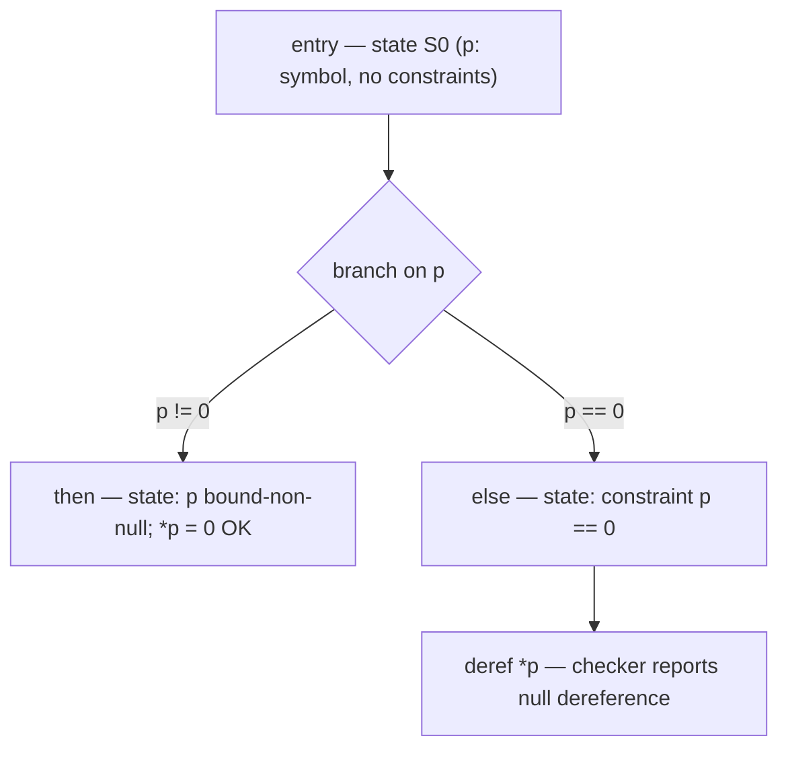

# Clang Static Analyzer

> 🧭 **Implementation** · `implementation · analysis · clang` · Index [[LLVM.MOC]]
> **Realizes:** [[source-level-analysis|source-level analysis]] + *symbolic execution* · **Prerequisites:** [[clang-cfg|Clang CFG]] · **Consumes:** the [[clang-cfg|Clang CFG]], [[pointer-alias-analysis|aliasing]] (implicitly, via its region model)

> [!abstract] What this note adds
> The engineering specifics of Clang's bug-finder: it does **path-sensitive, inter-procedural symbolic execution over the Clang CFG**, materializing every explored path as an **ExplodedGraph** whose nodes pair a **ProgramPoint** with a **ProgramState** (Environment + Store + constraints). Its **region-based memory model** gets field-sensitivity and aliasing for free — no separate alias pass. Checkers plug into this engine to emit diagnostics.

---

## 1. The component

A source-level bug finder built as a **symbolic execution engine** over the [[clang-cfg|Clang CFG]]. The engine entry point is `ExprEngine`, driven by the graph-building loop `CoreEngine` (`ExprEngine.h` holds `CoreEngine Engine` and `ExplodedGraph &G`; confirmed `clang/include/clang/StaticAnalyzer/Core/PathSensitive/ExprEngine.h:124,145,148`). Rather than propagate a single flow fact per program point, it walks feasible **paths** one at a time, tracking concrete-or-symbolic values, so it can reason "if this branch is taken, `p` is null here."

It realizes two ideas that live in the concept layer: *source-level analysis* (diagnostics phrased in terms of the user's source, not IR) and *symbolic execution* (values are symbols constrained by path conditions).

## 2. What it realizes (and why promoted)

- ***Source-level analysis*** — the analyzer runs on the AST-derived Clang CFG, so its reports point at source constructs (a specific `if`, a specific dereference) and can render an executable **bug path**. This is the actionable-diagnostics facet.
- ***Symbolic execution*** — the reason it can distinguish paths at all. Unknown inputs become symbols; branch conditions accumulate as **constraints**; a checker fires only on paths where the constraints make the bug feasible.

Contrast the flow-sensitive [[clang-dataflow-framework|Clang dataflow framework]] (`clang/Analysis/FlowSensitive`), which computes one lattice value per program point to a fixpoint (fast, sound-ish, no path split). The static analyzer instead **splits state per path** — more precise, but exponential, which is the source of its central trade-off (§8).

## 3. Where it runs

- `clang --analyze file.c` (the driver front door), or `clang -cc1 -analyze` / `-Xclang -analyze` for direct control.
- The same engine backs **`scan-build`** (wraps a build, runs the analyzer per TU, aggregates an HTML report) and clang-tidy's `clang-analyzer-*` checks (clang-tidy embeds the analyzer).
- It is **not** part of `-O2` codegen — it's an opt-in analysis phase over each translation unit, orthogonal to the optimization pipeline.

## 4. How it's built

The engine simulates the CFG and records what it learns as an immutable, foldable graph. Each core abstraction maps to one header (all paths under `clang/include/clang/StaticAnalyzer/Core/PathSensitive/`):

> [!info] Concept → class → confirming header
>
> | Role | Class | Header (confirmed) |
> |---|---|---|
> | The explored state space (one node per reached program point on a path) | `ExplodedGraph` / `ExplodedNode` | `ExplodedGraph.h` — `ExplodedNode` holds `const ProgramPoint Location` + a `ProgramStateRef`, `getLocation()` / `getState()` |
> | The abstract state at a node | `ProgramState` | `ProgramState.h` — its doc lists three parts: **Environment** (expr→value), **Store** (location→value), **Constraints** (GenericDataMap); fields `Environment Env`, `Store store`, `GenericDataMap GDM` |
> | Expr → value binding | `Environment` | `Environment.h` (`ProgramState::Env`) |
> | Region → value binding | `Store` / `StoreManager` | `Store.h` (`ProgramState::store`) |
> | Path conditions on symbols | `ConstraintManager` (stored in the GDM) | `ConstraintManager.h`, `ProgramState.h` |
> | Abstract lvalues (memory) | `MemRegion` + subclasses | `MemRegion.h` — `MemRegion`, `VarRegion`, `ElementRegion`, `FieldRegion`, `SymbolicRegion`, `MemSpaceRegion` |
> | Abstract rvalues (symbolic values) | `SVal` (`Loc` / `NonLoc`) | `SVals.h` — "abstract r-values for path-sensitive value tracking" |
> | Checker plug-in surface | `CheckerContext` / `CheckerManager` | `CheckerContext.h` — wraps `ExprEngine &Eng`, exposes `getState()`, `addTransition()` |

An **ExplodedNode** is exactly a `(ProgramPoint, ProgramState)` pair; `CoreEngine` drives a worklist that expands nodes, and `ExprEngine` computes the successor state for each CFG element. Because states are interned in a `FoldingSet`, two paths that reach an identical `(point, state)` **merge back** into one node — that's what keeps the graph finite-ish.

**Figure — a tiny ExplodedGraph for `if (p) *p = 0; else *p = 1;`.** Each node carries the ProgramState along that path; the null-deref checker fires on the else path where the constraint `p == 0` holds.



The reading: the engine does not evaluate `p`; it carries `p` as an **SVal** symbol and *constrains* it differently on each outgoing edge, so the bug is only reported on the path where it is actually reachable.

## 5. The region memory model

`Store` does not map variables to values directly — it maps **memory regions** to `SVal`s. A `MemRegion` is a partially-typed abstraction of an *lvalue*:

- A `VarRegion` is a declared variable's storage; a `SymbolicRegion` is the storage a symbolic pointer points at; a `MemSpaceRegion` is a whole space (stack, heap, globals).
- **Subregions give field- and element-sensitivity for free:** `FieldRegion` = "the `.f` sub-object of region R", `ElementRegion` = "the `[i]`-th element of R". So `s.a` and `s.b` are distinct regions and never alias, while `p->x` and `q->x` alias exactly when `p` and `q` resolve to the same base region.
- **Aliasing falls out of region identity** — there is no separate points-to/alias pass feeding the store. Two lvalue expressions alias iff they name the same region, which the region hierarchy decides structurally.

> [!quote] Design origin
> This region model comes from **Xu, Kremenek & Zhang, "A Memory Model for Static Analysis of C Programs" (ISoLA 2010)** — the paper that formalizes regions/subregions as the store's domain. The analyzer was created at Apple (Ted Kremenek), which is why the design and the region model share that lineage.

## 6. The constraint domain — and why CSA is non-relational

The third component of `ProgramState` — *"constraints on symbolic values"* — is held by a `ConstraintManager`. The default in-tree solver is `RangeConstraintManager` (which extends `RangedConstraintManager`, itself built on `SimpleConstraintManager`), which stores, per `SymbolRef`, a `RangeSet`: a union of closed integer intervals `[from, to]` (`RangedConstraintManager.h` — `Range` is *"the closed range [from, to]"*). Constraints flow in through `assume`:

- At a branch, `ExprEngine` calls `ConstraintManager::assumeDual(state, cond)`, which returns a pair `(state_true, state_false)` — the two successor states in which `cond` is assumed true / false. **That pair is the fork.** An infeasible side comes back null and the path is pruned.
- Queries are per symbol: `getSymVal`, `getSymMinVal`, `getSymMaxVal` — a symbol's constant, or its interval endpoints.

> [!warning] Non-relational by construction
> A `RangeSet` bounds each symbol *independently*; there is no entry for `x − y ≤ c`. So CSA's default numeric reasoning is **interval-flavored and non-relational** — the same expressiveness ceiling as the pointwise store in [[dataflow-worked-example]], reached by a different mechanism. Relations survive only implicitly, as *separate feasible paths*, never as a joined relational fact. Explicit relational constraints require swapping in the optional `SMTConstraintManager` (`SMTConstraintManager.h`, `SMTConv.h`), which discharges the path condition with an SMT solver — richer, per-path, and off by default. A true octagon is the clang::dataflow exercise in [[dataflow-relational-octagon]], not something CSA offers in-tree.

Two reframings worth stating precisely — they separate CSA from abstract interpretation even though both walk the CFG:

- **The merge is state *equality*, not a lattice join.** §4 noted that two paths reaching an identical `(ProgramPoint, ProgramState)` coalesce via `FoldingSet` interning. That is *syntactic equality of interned states*, not a $\sqcup$ that over-approximates two distinct states into a weaker one. CSA never joins distinct states — it keeps them as separate paths. It thus explores a bounded fragment of the **trace / disjunctive** semantics; the absence of a join is exactly why it retains path correlations (precision) **and** why it explodes (no compression). Contrast [[clang-dataflow-framework]], whose entire job at a merge is the lossy $\sqcup$.
- **CSA "widening" is invalidation, not a numeric $\nabla$.** For a loop that would not otherwise terminate exploration, `LoopWidening.h` widens by *"invalidating anything that might be modified"* by the body of the loop — it sets the possibly-modified regions to unknown to force convergence. This is a soundness-restoring sledgehammer, categorically unlike an octagon widening $\nabla$ that extrapolates a numeric bound in a domain with an ascending-chain-breaking operator. CSA's termination story is *budgets + unroll caps + this invalidation*, not a lattice fixpoint.

## 7. Run it yourself

> [!example]+ Invoke the analyzer with the core checkers
> ```bash
> # analyze a single TU with the always-on 'core' checker package
> clang --analyze -Xclang -analyzer-checker=core foo.c
>
> # list available checkers
> clang -cc1 -analyzer-checker-help
>
> # whole-project HTML report
> scan-build make
> ```
> On a genuine null-deref or leak, the analyzer emits a diagnostic plus a numbered **bug path** through the source lines that led there. (Exact wording/format is version-dependent — run it to see the real output.)

## 8. Limitations & version notes

> [!warning] What it will and won't do
> - **Path explosion.** Splitting state per path is exponential in branch/loop count. The engine bounds work with budgets and heuristics (a max node count, loop-unroll/widen limits such as `LoopUnrolling.h` / `LoopWidening.h`, inlining stack-depth caps); when a budget is hit, it stops exploring and may miss bugs on the cut paths.
> - **Deliberately unsound *and* incomplete.** It is not a verifier. It trades soundness for a **false-positive budget** — a check that would be noisy is suppressed even at the cost of missed true positives, because usable diagnostics beat exhaustive ones. Absence of a report is *not* a proof of absence of the bug.
> - **Mostly intra-TU.** By default it analyzes one translation unit; it inlines callees within the TU but doesn't see across TU boundaries. **Cross-translation-unit (CTU)** analysis exists but is **opt-in** (`ExprEngine` carries `CrossTranslationUnitContext &CTU` + an `IsCTUEnabled` flag, confirmed `ExprEngine.h:138-139`) and requires an extra AST-index build step.

> [!summary] The one thing to remember
> The Clang Static Analyzer is **path-sensitive symbolic execution over the Clang CFG**: an **ExplodedGraph** of `(ProgramPoint, ProgramState)` nodes, where `ProgramState = Environment + Store + constraints`, the **Store** maps a **region-based** memory model to **SVal** symbols, and checkers ride the engine to emit source-level bug paths — precise but deliberately unsound and budget-bounded.

> [!quote] Sources & confidence
> - **Tier-1 source (pinned tag / current):** `clang/lib/StaticAnalyzer` and the PathSensitive headers — `ExplodedGraph.h`, `ProgramState.h`, `MemRegion.h`, `SVals.h`, `CheckerContext.h`, `ExprEngine.h`, `CoreEngine.h`. Class/field claims in §4 were read directly from these headers.
> - **Primary docs:** [Clang Static Analyzer](https://clang.llvm.org/docs/ClangStaticAnalyzer.html), [Static Analyzer developer docs](https://clang.llvm.org/docs/analyzer/).
> - **Design origin:** Zhongxing Xu, Ted Kremenek, Jian Zhang. *A Memory Model for Static Analysis of C Programs.* ISoLA 2010, LNCS 6415, pp. 535–548. (The region-based store.)
