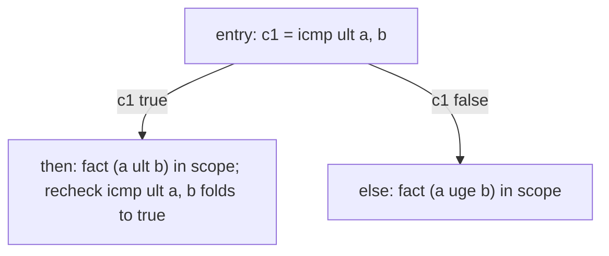

# LLVM ConstraintElimination

> 🧭 **Implementation** · `implementation · optimization · llvm` · Index [[LLVM.MOC]]
> **Realizes:** relational range/constraint reasoning · **Prerequisites:** [[llvm-basics]], [[dominator-tree]] · **Siblings:** [[lazy-value-info]], [[correlated-value-propagation]]

> [!abstract] What this note adds
> The pass that **eliminates a comparison when it is *implied* by conditions that dominate it**. It keeps a system of **linear integer inequalities** (signed + unsigned), decomposes each `icmp`/GEP into coefficient rows, and decides implication by **Fourier–Motzkin elimination**. This is the mechanism that removes redundant checks — most notably the runtime bounds checks inserted by `-fbounds-safety`.

---

## 1. The pass

`ConstraintEliminationPass` — one file, `llvm/lib/Transforms/Scalar/ConstraintElimination.cpp`, entry `eliminateConstraints(Function&, ...)`. Its own header states the job exactly: *"Eliminate conditions based on constraints collected from dominating conditions."* It realizes lightweight **relational** value reasoning (a range/relation analysis over `≤` facts), sitting alongside the predicate-based [[lazy-value-info|LazyValueInfo]] / [[correlated-value-propagation|CVP]] family but using a genuine linear-inequality solver rather than per-value lattices.

## 2. What it realizes (and why promoted)

A **relational** analysis: instead of "what range does `x` have?" it answers "does `a·x − b·y ≤ c` **follow** from the facts in scope?" That extra relational power (two variables, scaled coefficients) is what lets it discharge checks a per-variable range analysis can't. It gets its own note because it is the **workhorse behind bounds-check elimination**: the frontend emits a trap-guarded `icmp` for every access it can't prove safe, and this pass folds the redundant ones to `true`/`false` so later passes delete the dead trap.

## 3. Where it runs

- **On by default** in the optimization pipeline: `PassBuilderPipelines.cpp` adds `ConstraintEliminationPass()` to the function simplification pipeline, guarded by the hidden `-enable-constraint-elimination` (default `true`).
- Standalone: `opt -passes=constraint-elimination -S in.ll` (registered as `"constraint-elimination"` in `PassRegistry.def`).
- Consumes **[[dominator-tree|DominatorTree]]** (fact scoping), plus `LoopInfo`, `ScalarEvolution`, and `ValueTracking` as helper analyses.

## 4. How it's built

The engine walks the function once, maintaining a constraint system whose facts are **scoped by dominance** — a fact learned on a branch edge is valid only inside the region that edge dominates.

> [!info] The moving parts (all in `ConstraintElimination.cpp` / `Analysis/ConstraintSystem.h`)
>
> | Piece | Role |
> |---|---|
> | `FactOrCheck` (in a `SmallVector` worklist) | one entry per **fact** (a dominating condition, an `llvm.assume`, or a GEP `nowrap`) or **check** (an `icmp`/`min`/`max`/overflow intrinsic to try to discharge) |
> | `ConstraintInfo` | holds **two** `ConstraintSystem`s — one **unsigned**, one **signed** — since `ult` and `slt` facts don't mix |
> | `Decomposition` | lowers a value/GEP into a **coefficient vector** `{constant, c₁·v₁, c₂·v₂, …}` over SSA values |
> | `ConstraintSystem` | the inequalities as **sparse rows** of `int64` coefficients (`SmallVector<SmallVector<Entry>>`) |
> | `StackEntry` | records a pushed fact's dominance scope so it is **popped on leaving** that subtree |

**Algorithm:**
1. Collect all `FactOrCheck`s, then **`stable_sort` them in dominator-tree order** so every fact is processed before the checks it dominates.
2. Walk the sorted worklist. On a **fact**, `addFact` decomposes it and pushes rows into the signed/unsigned system (with a `StackEntry` for its scope). On leaving a dominated region, pop.
3. On a **check**, decompose it and call `isConditionImplied`: add the **negation** of the condition and test whether the system becomes infeasible via **`ConstraintSystem::eliminateUsingFM`** — **Fourier–Motzkin elimination** (with integer tricks from Pugh's *Omega test*, 1991; implemented as sparse Gaussian-style variable elimination). If implied, the compare is replaced by a constant `i1`.

**Figure — a fact dominates a recheck.** In `then`, the true edge of `c1` puts `a ult b` in scope, so the identical recheck is provably `true` and folds; later DCE removes anything guarded by it.



## 5. Textbook → LLVM (deviations)

> [!info]+ Classic relational analysis vs. this pass
> | Classic abstract interpretation | ConstraintElimination |
> |---|---|
> | Maintain a **closed relational domain** (Zones/Octagon/Polyhedra) as a lattice element, joined at CFG merges | Keeps an **ad-hoc constraint set**, scoped by dominance, and **re-runs Fourier–Motzkin per query** — no maintained closure, no join |
> | Fixpoint over the whole CFG | Single **dominator-tree-ordered** pass; facts pushed/popped by scope |
> | Domain fixes an expressiveness class up front | Decomposes each check on demand into `int64` coefficient rows (bails when index width > 64 bits) |

The trade is deliberate: cheap and simple, but it **forgets** derived relations between queries — a place where a maintained relational domain (difference-bound matrices, octagons) could prove more, especially loop-carried facts.

## 6. Run it yourself

> [!example]+ Fold a dominated recheck
> ```bash
> opt -passes=constraint-elimination -S in.ll
> ```
> ```llvm
> ; in.ll — %c2 is dominated by "%c1 == true", i.e. (a u< b) already holds
> define i1 @f(i32 %a, i32 %b) {
>   %c1 = icmp ult i32 %a, %b
>   br i1 %c1, label %then, label %else
> then:
>   %c2 = icmp ult i32 %a, %b     ; ← implied by the dominating condition
>   ret i1 %c2                    ; becomes  ret i1 true
> else:
>   ret i1 false
> }
> ```
> The pass rewrites `%c2` to `true`. (Run it to see exact output; folding is version-stable, formatting is not.)

## 7. Flags & knobs

- `-enable-constraint-elimination` (hidden, **default `true`**) — pipeline gate in `PassBuilderPipelines.cpp`.
- Internal `cl::opt`s bound the work (max rows / constraint-system size) and a `DebugCounter` (`-debug-counter=…`) allows bisecting individual transforms.
- `-passes=constraint-elimination` runs it in isolation.

## 8. Siblings & variants

- **[[lazy-value-info|LazyValueInfo]]** + **[[correlated-value-propagation|CorrelatedValuePropagation]]** — the per-value predicate/range family; complementary (they carry lattice ranges; this carries relations).
- **[[getelementptr|GEP]] `nowrap`** — a fact *source* here (a `inbounds`/`nuw` GEP implies its offset doesn't wrap), which is why `-fbounds-safety` marks `p + count` `inbounds`.

## 9. Limitations & version notes

> [!warning] What it won't do
> - **No maintained closure.** It re-derives via Fourier–Motzkin per check and doesn't keep the transitive relational state between queries — so recurring loop relations are re-proven, not accumulated.
> - **64-bit coefficients.** Decomposition bails when the index type exceeds 64 bits (coefficient add/mul could overflow).
> - **Relational but bounded.** It reasons about linear inequalities over (mostly two) SSA values; properties needing ≥3-variable constraints or non-template coefficients fall outside what the decomposition captures.

> [!summary] The one thing to remember
> ConstraintElimination **folds a comparison that a dominating condition already implies**, by keeping signed/unsigned systems of linear inequalities and deciding implication with **Fourier–Motzkin** — the default-on pass that claws back the overhead of inserted checks (notably `-fbounds-safety` bounds checks), at the cost of re-deriving relations per query instead of maintaining a closed relational domain.

> [!quote] Sources & confidence
> - **Tier-1 source:** [`Transforms/Scalar/ConstraintElimination.cpp`](https://github.com/llvm/llvm-project/blob/main/llvm/lib/Transforms/Scalar/ConstraintElimination.cpp) and [`Analysis/ConstraintSystem.{h,cpp}`](https://github.com/llvm/llvm-project/blob/main/llvm/lib/Analysis/ConstraintSystem.cpp) (the `eliminateUsingFM` Fourier–Motzkin core, citing Pugh's Omega test). Pipeline gate in [`PassBuilderPipelines.cpp`](https://github.com/llvm/llvm-project/blob/main/llvm/lib/Passes/PassBuilderPipelines.cpp); registration in [`PassRegistry.def`](https://github.com/llvm/llvm-project/blob/main/llvm/lib/Passes/PassRegistry.def). Class/algorithm claims read directly from these files.
> - **Design context:** the pass was motivated in part by redundant bounds-check removal for [`-fbounds-safety`](https://clang.llvm.org/docs/BoundsSafety.html) (see its implementation-plans doc).
