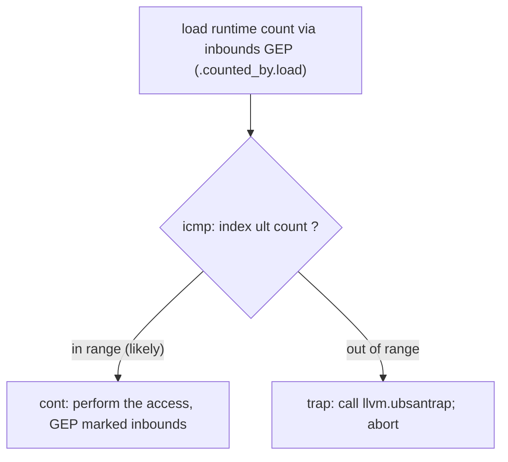

# -fbounds-safety

> 🧭 **Implementation** · `implementation · frontend · clang` · Index [[LLVM.MOC]]
> **Realizes:** spatial [[Memory-Safety-Hardening.MOC|memory safety]] for C · **Prerequisites:** [[clang-ast|Clang AST]], [[getelementptr|GEP]] · **Collaborates with:** [[constraint-elimination|ConstraintElimination]] (middle-end), [[safe-buffers|Safe Buffers]] (C++ sibling)

> [!abstract] What this note adds
> The engineering of Clang's **`-fbounds-safety`** C language extension: how a **bounds annotation written as a Clang type attribute** (`__counted_by(N)` and friends) becomes a `CountAttributedType` **sugar node** on the [[clang-ast|AST]] in **Sema**, how **CodeGen** turns each unprovable access into a **trap-guarded compare**, and how the [[constraint-elimination|middle-end]] then folds away the checks it can prove redundant. Three layers, one invariant: an out-of-bounds access is either **rejected at compile time** or **traps at runtime** — never a silent overread.

---

## 1. The extension

`-fbounds-safety` is a **C-only language extension for spatial (bounds) safety**: you annotate pointers with their bounds, and the compiler guarantees every access is in range. It is gated behind the experimental driver flag **`-fexperimental-bounds-safety`** (Sema logic in `clang/lib/Sema/SemaBoundsSafety.cpp`, whose file comment states it "declares semantic analysis functions specific to `-fbounds-safety` … and also its attributes when used without `-fbounds-safety` (e.g. `counted_by`)"). It realizes the concept of [[Memory-Safety-Hardening.MOC|memory safety]] — specifically the *spatial* half (bounds), not the *temporal* half (use-after-free), which is [[Memory-Safety-Hardening.MOC|another mechanism's]] job.

The design is a **three-layer collaboration**: Sema (annotations → AST), CodeGen (AST → trap-guarded IR), and the middle-end (fold the redundant checks).

## 2. Layer 1 — Sema: bounds as type attributes

Bounds are written as **Clang type attributes** on a pointer, and carried on the AST as a **sugar type**:

> [!info] The bounds annotations
>
> | Annotation | Meaning | Landed as |
> |---|---|---|
> | `__counted_by(N)` | pointer to `N` elements | `CountAttributedType` (kind `CountedBy`) |
> | `__counted_by_or_null(N)` | as above, or null | `CountAttributedType` (`CountedByOrNull`) |
> | `__sized_by(N)` | pointer to `N` **bytes** | `CountAttributedType` (`SizedBy`) |
> | `__sized_by_or_null(N)` | as above, or null | `CountAttributedType` (`SizedByOrNull`) |
> | `__single` | points to exactly one object (default for annotated ptrs) | see the Unverified note in §3 |
> | `__ended_by(end)` | valid up to the pointer `end` | see the Unverified note in §3 |
> | `__null_terminated` | range ends at a null element | see the Unverified note in §3 |

`__counted_by`/`__sized_by` are the **fully-landed** core. Each attaches to a pointer type and produces a **`CountAttributedType`** — declared in `clang/include/clang/AST/TypeBase.h` as *"a sugar type with `__counted_by` or `__sized_by` annotations, including their `_or_null` variants."* Being **sugar**, it wraps the plain pointer type (`ptr` stays `ptr`); it just remembers the count expression (`getCountExpr()`) and the coupled declarations the count depends on, so later phases can recover the bound. The four kinds come straight from its `DynamicCountPointerKind` enum: `CountedBy`, `SizedBy`, `CountedByOrNull`, `SizedByOrNull`.

Sema also enforces the **paired-assignment invariant**: because a pointer and its count are two separate lvalues, whenever you update one you must update the other in the same "checkpoint," so the count field always describes the pointer's real extent. That coupling is why `CountAttributedType` records the `TypeCoupledDeclRefInfo` list of decls the count refers to.

## 3. Layer 2 — CodeGen: trap-guarded accesses

The annotation is metadata; **CodeGen** is where it becomes a real check. On an access through a `__counted_by` member, `CodeGenFunction::EmitCountedByBoundsChecking` (`clang/lib/CodeGen/CGExpr.cpp`) fires — its comment: *"If the array being accessed has a 'counted_by' attribute, generate bounds checking code."* It:

1. Recognizes the member has an `isCountAttributedType()` type and finds the counted-by field (`findCountedByField()`).
2. Emits a GEP + load to read the **runtime count** (`.counted_by.gep` / `.counted_by.load`), using `CreateInBoundsGEP` — an **`inbounds`** [[getelementptr|GEP]].
3. Calls `EmitBoundsCheckImpl`, which compares the index against that count under `SanitizerHandler::OutOfBounds` and, on failure, calls `EmitTrapCheck`.

`EmitTrapCheck` creates a basic block named **`"trap"`**, branches to it with a *likely-not-taken* weight, and in it calls the **`llvm.ubsantrap`** intrinsic — the trap that aborts the program instead of letting the overread happen. The normal path continues to the `"cont"` block. So each unprovable dereference lowers to:

**Reading:** the frontend does *not* trust the index; it emits an explicit compare against the annotated bound, and the only way past it is to be provably in range — otherwise `llvm.ubsantrap`. The element access GEP itself is emitted with `/*inbounds*/ true`, which both encodes the no-wrap fact and feeds the middle-end (§4).

> [!danger] Unverified
> The full `-fbounds-safety` model described in `BoundsSafety.html` — **thin vs. wide/"fat" pointers** where a local annotated pointer is lowered to a `{ptr, upper, lower}` triple (thin ABI pointers at boundaries, wide pointers internally), and the `__single` / `__ended_by` / `__null_terminated` annotations — is **not fully landed as grep-able keywords** at the pinned tag (see [[llvm-version]]). At this tag the in-tree, confirmed machinery is `__counted_by`/`__sized_by` → `CountAttributedType` → `EmitCountedByBoundsChecking`. The wide-pointer representation and the additional annotations are part of the design being upstreamed incrementally; treat those specifics as design-doc claims, not tier-1-confirmed here.

## 4. Layer 3 — middle-end: fold the redundant checks

Emitting a compare-and-trap at *every* unprovable access is deliberately naive — it leans on the optimizer to claw the cost back. The pass that does it is **[[constraint-elimination|ConstraintElimination]]**: it keeps signed/unsigned systems of linear inequalities scoped by dominance and, per `icmp`, decides via Fourier–Motzkin whether the check is **implied by a dominating fact**. When it is, the compare folds to a constant and later DCE deletes the dead `"trap"` block. The `inbounds` on the access GEP is one of the facts it consumes (a no-wrap GEP bounds its offset), which is exactly why CodeGen marks `p + count` `inbounds`. Net effect: correctness comes from the frontend's checks; performance comes from the middle-end proving most of them away.

## 5. Why this makes OOB unexploitable

Two enforcement axes cover the space between them:

- **Compile-time rejection** — Sema rejects code where the paired pointer/count invariant can't hold, so whole classes of mistakes never compile.
- **Runtime trap** — every access the compiler can't *prove* in-bounds carries a check that ends in `llvm.ubsantrap`.

Together: an out-of-bounds access is either a **build error** or a **deterministic trap** — never a silent memory-corruption primitive. That is the security claim (an OOB becomes a crash, not an exploit), at the cost of the checks the middle-end couldn't remove.

## 6. Limitations & version notes

> [!warning] Experimental and C-only
> - **Experimental / upstreaming.** The extension is gated by **`-fexperimental-bounds-safety`** (`LangOpts BoundsSafety`, **default off**; `clang/include/clang/Options/Options.td`, help text "experimental bounds safety extension for C"). It is being landed incrementally — the annotation surface and lowering available at any given tag depend on the release. **`version-sensitive`** → [[llvm-version]].
> - **C only.** No C++ / Objective-C support yet. The C++ story is the separate [[safe-buffers|Safe Buffers]] / hardened-`std::span` effort, not this flag.
> - **Standalone `counted_by`.** `__counted_by` works as a plain attribute *without* `-fbounds-safety` (e.g. to bounds-check flexible-array members) — that narrower use is what most of `EmitCountedByBoundsChecking` targets today.

> [!summary] The one thing to remember
> `-fbounds-safety` is a **C spatial-safety extension** in three layers: **Sema** carries bounds as **type attributes** → a `CountAttributedType` sugar node on the [[clang-ast|AST]]; **CodeGen** turns each unprovable access into a **compare-and-`llvm.ubsantrap`** guard with `inbounds` [[getelementptr|GEPs]]; and the **[[constraint-elimination|middle-end]]** folds away the checks it can prove redundant — so an OOB access is either a build error or a trap, never a silent overread. Experimental (`-fexperimental-bounds-safety`), C-only, being upstreamed.

> [!quote] Sources & confidence
> - **Tier-1 source (pinned tag, see [[llvm-version]]):** Sema in [`clang/lib/Sema/SemaBoundsSafety.cpp`](https://github.com/llvm/llvm-project/blob/main/clang/lib/Sema/SemaBoundsSafety.cpp) (file comment naming `-fbounds-safety` + standalone `counted_by`); the `CountAttributedType` "sugar type with `__counted_by`/`__sized_by`" and its `DynamicCountPointerKind` enum in [`clang/include/clang/AST/TypeBase.h`](https://github.com/llvm/llvm-project/blob/main/clang/include/clang/AST/TypeBase.h); the attributes `CountedBy`/`SizedBy`(`_or_null`) in [`clang/include/clang/Basic/Attr.td`](https://github.com/llvm/llvm-project/blob/main/clang/include/clang/Basic/Attr.td); CodeGen `EmitCountedByBoundsChecking` / `EmitBoundsCheckImpl` / `EmitTrapCheck` (`llvm.ubsantrap`, `"trap"`/`"cont"` blocks, `CreateInBoundsGEP`) in [`clang/lib/CodeGen/CGExpr.cpp`](https://github.com/llvm/llvm-project/blob/main/clang/lib/CodeGen/CGExpr.cpp) and [`CGBuiltin.cpp`](https://github.com/llvm/llvm-project/blob/main/clang/lib/CodeGen/CGBuiltin.cpp); the driver flag `-fexperimental-bounds-safety` (`LangOpts BoundsSafety`, default false) in [`clang/include/clang/Options/Options.td`](https://github.com/llvm/llvm-project/blob/main/clang/include/clang/Options/Options.td). Class/flag/lowering claims in §1–§4 were read directly from these files.
> - **Primary docs:** [Clang — `-fbounds-safety`](https://clang.llvm.org/docs/BoundsSafety.html) (the full design: thin vs. wide pointers, `__single`/`__ended_by`/`__null_terminated`).
> - **Unverified:** the wide/"fat" `{ptr, upper, lower}` pointer representation and the `__single`/`__ended_by`/`__null_terminated` annotations are design-doc claims, not confirmed grep-able in-tree at the pinned tag (see the `> [!danger] Unverified` note in §3).
