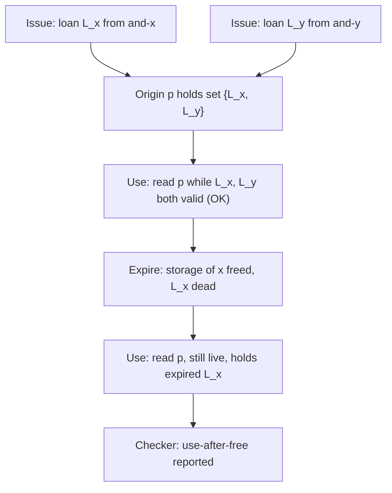

# Clang LifetimeSafety

> 🧭 **Implementation** · `implementation · analysis · clang` · Index [[LLVM.MOC]]
> **Realizes:** [[data-flow-analysis|dataflow analysis]] (for temporal safety) · **Prerequisites:** [[clang-cfg|Clang CFG]], [[data-flow-analysis|data-flow analysis]] · **Consumes:** the [[clang-cfg|Clang CFG]]

> [!abstract] What this note adds
> The engineering specifics of Clang's new **temporal-safety** analysis: an **intra-procedural** dataflow pass over the [[clang-cfg|Clang CFG]] that catches use-after-free and dangling pointers/references. Its two nouns are **Loans** (a borrow of some storage) and **Origins** (the set of loans a pointer-like value may hold — a provenance/points-to set). A `FactsGenerator` lowers the CFG to atomic **Facts**; a **forward** loan-propagation and a **backward** live-origins analysis run over a shared monotone-dataflow engine; the **Checker** fires when a live origin holds a loan whose storage has already expired. The design is consciously **Rust-NLL-shaped**.

---

## 1. The component

An intra-procedural, source-level analysis for **temporal (lifetime) safety** — use-after-free, dangling pointers, dangling references — built on the [[clang-cfg|Clang CFG]]. The entry point is `LifetimeSafetyAnalysis` (the public driver `runLifetimeSafetyAnalysis`), which orchestrates the whole pipeline: fact generation, then loan propagation, then live-origins, then the check (confirmed `LifetimeSafety.h:66,85` and `LifetimeSafety.cpp:55-93`). Everything lives in the `clang::lifetimes::internal` namespace under `clang/lib/Analysis/LifetimeSafety`.

It realizes one concept from the concept layer: [[data-flow-analysis|dataflow analysis]] — but pointed at *temporal* rather than the usual value/constant facts. The lattice values are per-origin **loan sets** (forward) and per-origin **liveness** (backward), both propagated to a fixpoint over the CFG.

## 2. What it realizes (and why promoted)

- **[[data-flow-analysis|Dataflow] for temporal safety.** Two classical dataflow analyses cooperate: a *forward* one that answers "which loans can this origin hold here?" and a *backward liveness* that answers "is this origin still going to be read?". The check is a join of the two at each loan-expiration point.
- **Contrast the path-sensitive [[clang-static-analyzer]].** The static analyzer *splits state per path* via symbolic execution (precise, exponential, deliberately unsound). LifetimeSafety instead computes **one lattice value per program point** to a fixpoint — cheaper and flow-sensitive, in the same family as the [[clang-dataflow-framework|Clang dataflow framework]], not the ExplodedGraph. It trades per-path precision for scalability.
- **Contrast the spatial focus of bounds work.** Most memory-safety tooling in C++ chases *spatial* safety (out-of-bounds, `-fbounds-safety`). This analysis is orthogonal: it is about *when* storage is valid, not *how big* it is.

## 3. Where it runs

- A **front-end warning/analysis**, not codegen. It runs over the AST-derived Clang CFG during semantic analysis, surfacing as `-Wlifetime-safety-*` diagnostics — `Confidence::Definite` under the permissive mode and `Confidence::Maybe` under the strict mode (confirmed `LifetimeSafety.h:33-37`).
- It is **not** part of `-O2` / the LLVM IR optimization pipeline. Like the [[clang-static-analyzer]] it is orthogonal to codegen, but unlike the analyzer it is designed to be cheap enough to run as an ordinary warning.
- Results are also reachable programmatically via a `LifetimeSafetyReporter` callback interface (`reportUseAfterFree`, `reportUseAfterReturn`, `suggestAnnotation`; `LifetimeSafety.h:45-63`).

## 4. How it's built

The pipeline is: **CFG → Facts → two dataflow analyses → Checker.** Each stage maps to one header.

> [!info] Concept → class → confirming header
>
> | Role | Class / entry | Header (confirmed) |
> |---|---|---|
> | A borrow of a storage location | `Loan` (`PathLoan` = a visible local's storage via an `AccessPath`; `PlaceholderLoan` = a borrow from the caller, per parameter) | `Loans.h:39,67,97` |
> | The set of loans a pointer-like value may hold (its provenance) | `Origin` + `OriginList` (one origin for the lvalue itself plus one per indirection level; `int* p` → length 2, `int**` → length 3) | `Origins.h:32-38,93` |
> | Atomic lifetime events lowered from the CFG | `Fact` — `Issue`, `Expire`, `OriginFlow`, `Use`, `OriginEscapes` (+ a testing-only `TestPoint`) | `Facts.h:31-51` |
> | Lower CFG statements into per-block facts | `FactsGenerator` (an AST `ConstStmtVisitor`) | `FactsGenerator.h:27,34` |
> | Forward: which loans each origin holds | `LoanPropagationAnalysis` — lattice `OriginLoanMap = ImmutableMap<OriginID, LoanSet>` | `LoanPropagation.h:29-32` |
> | Backward: which origins are still live | `LiveOriginsAnalysis` — lattice `LivenessMap = ImmutableMap<OriginID, LivenessInfo>` (`Must` / `Maybe` / `Dead`) | `LiveOrigins.h:37-41,78` |
> | The generic monotone-dataflow engine (lattice + transfer + join to fixpoint) | `DataflowAnalysis<Derived, Lattice, Dir>` (CRTP, `Forward` / `Backward`) | `Dataflow.h:56` |
> | Flag a use whose origin holds an expired loan | `runLifetimeChecker` / `LifetimeChecker` | `Checker.h:28`, `Checker.cpp:51` |

**The engine.** `Dataflow.h` is a small, generic monotone-dataflow driver (`Dataflow.h:38-56`): the derived class supplies a `Lattice`, an initial state, a `join` (merge of states arriving from multiple CFG paths), and `transfer` overloads per fact kind. The driver runs a worklist over CFG blocks — successors for `Forward`, predecessors for `Backward` — and enqueues a neighbor whenever its joined in-state changes, iterating to a fixpoint (`Dataflow.h:85-118`). Loan-propagation instantiates it forward; live-origins instantiates it backward.

**The transfer intuition.** An `IssueFact` (from `&x`) puts a fresh loan into an origin's set; an `OriginFlowFact` (from `p = q`) merges `q`'s loan set into `p`'s (optionally *killing* `p`'s old loans first); an `ExpireFact` (storage goes out of scope) marks a loan dead; a `UseFact` (a read of a pointer) is what makes an origin *live* in the backward pass (`Facts.h:34-51`).

**Figure — loans flow into an origin, then a use after the loan expires.** Two borrows issue loans that flow into origin `p`; after `x` goes out of scope its loan has expired, so the later read of `p` is a use-after-free.

The reading: loan-propagation (forward) tells us `p` may hold `L_x`; live-origins (backward) tells us `p` is still read at `U2`; the `Checker` walks every `ExpireFact` and, for each still-live origin holding that expired loan, emits a diagnostic whose confidence is `Definite` when the origin is `Must`-live and `Maybe` otherwise (`Checker.cpp:30-40,67-70`).

## 5. The Rust-NLL analogy

The vocabulary is borrowed directly from Rust's **non-lexical lifetimes (NLL)** borrow checker — the design is Rust-NLL-inspired, driven by Gábor Horváth (Apple), and aimed at hardening C++ and Swift/C++ interop.

> [!info] LifetimeSafety ↔ Rust NLL
>
> | Clang LifetimeSafety | Rust NLL |
> |---|---|
> | **Loan** — a borrow of a storage location | a *borrow* (`&x`) |
> | **Origin** — the set of loans a pointer may hold | a *region* / *provenance* variable |
> | loan flows into origin on assignment | borrow flows into a lifetime variable |
> | live-origins backward analysis | NLL *liveness* of regions (the "non-lexical" part) |
> | expired loan held by a live origin | a borrow used past the end of the borrowed value |

Because origins are propagated by *dataflow to a fixpoint* rather than by lexical scoping, a loan is considered live exactly across the program points where the pointer is still used — the same "non-lexical" precision Rust's NLL introduced. In practice this lets the analysis catch dangling **`lifetime_capture_by(this)`** captures and dangling non-static data member initializers (NSDMIs), the interop cases that motivated it.

## 6. Limitations & version notes

> [!warning] What it will and won't do
> - **Intra-procedural.** It analyzes one function body over its CFG; it does not follow loans across call boundaries. Caller-borrows are modeled coarsely by `PlaceholderLoan`s at parameters (`Loans.h:84-112`), and an escaping origin triggers an annotation *suggestion* (the `clang::lifetimebound` attribute) rather than a cross-function proof.
> - **C++-focused and pointer-like-only.** Only pointer/reference-like values get origins (`hasOrigins`, `Origins.h:119`); `AccessPath` currently models only a whole `ValueDecl`'s storage — the header's own TODOs note that fields (`s.field`), heap, and globals are not yet modeled (`Loans.h:30`).
> - **New and evolving.** This is a recent, actively-developed addition (see the [RFC](https://discourse.llvm.org/t/rfc-intra-procedural-lifetime-analysis-in-clang/86291)); the whole surface sits in `clang::lifetimes::internal` and is peppered with `TODO`s. Treat specific class shapes as [[llvm-version|version-sensitive]].

> [!summary] The one thing to remember
> Clang **LifetimeSafety** is a Rust-NLL-shaped, **intra-procedural** dataflow pass over the Clang CFG: **Loans** (borrows) flow into **Origins** (per-pointer provenance sets) via a *forward* analysis, a *backward* liveness marks which origins are still read, and the **Checker** reports a use-after-free wherever a live origin holds a loan whose storage has expired.

> [!quote] Sources & confidence
> - **Tier-1 source:** [`clang/lib/Analysis/LifetimeSafety`](https://github.com/llvm/llvm-project/tree/main/clang/lib/Analysis/LifetimeSafety) — every class/field claim above was read directly from the headers: [`Loans.h`](https://github.com/llvm/llvm-project/blob/main/clang/include/clang/Analysis/Analyses/LifetimeSafety/Loans.h), [`Origins.h`](https://github.com/llvm/llvm-project/blob/main/clang/include/clang/Analysis/Analyses/LifetimeSafety/Origins.h), [`Facts.h`](https://github.com/llvm/llvm-project/blob/main/clang/include/clang/Analysis/Analyses/LifetimeSafety/Facts.h), [`FactsGenerator.h`](https://github.com/llvm/llvm-project/blob/main/clang/include/clang/Analysis/Analyses/LifetimeSafety/FactsGenerator.h), [`LoanPropagation.h`](https://github.com/llvm/llvm-project/blob/main/clang/include/clang/Analysis/Analyses/LifetimeSafety/LoanPropagation.h), [`LiveOrigins.h`](https://github.com/llvm/llvm-project/blob/main/clang/include/clang/Analysis/Analyses/LifetimeSafety/LiveOrigins.h), [`Checker.h`](https://github.com/llvm/llvm-project/blob/main/clang/include/clang/Analysis/Analyses/LifetimeSafety/Checker.h), [`LifetimeSafety.h`](https://github.com/llvm/llvm-project/blob/main/clang/include/clang/Analysis/Analyses/LifetimeSafety/LifetimeSafety.h), and `Dataflow.h` (the generic engine, in `lib/`). Orchestration read from `LifetimeSafety.cpp` and `Checker.cpp`.
> - **Design origin / RFC:** [RFC — Intra-procedural lifetime analysis in Clang](https://discourse.llvm.org/t/rfc-intra-procedural-lifetime-analysis-in-clang/86291) (cited in `LifetimeSafety.h`). Rust-NLL lineage; led by Gábor Horváth (Apple), motivated by C++ and Swift/C++ interop.
