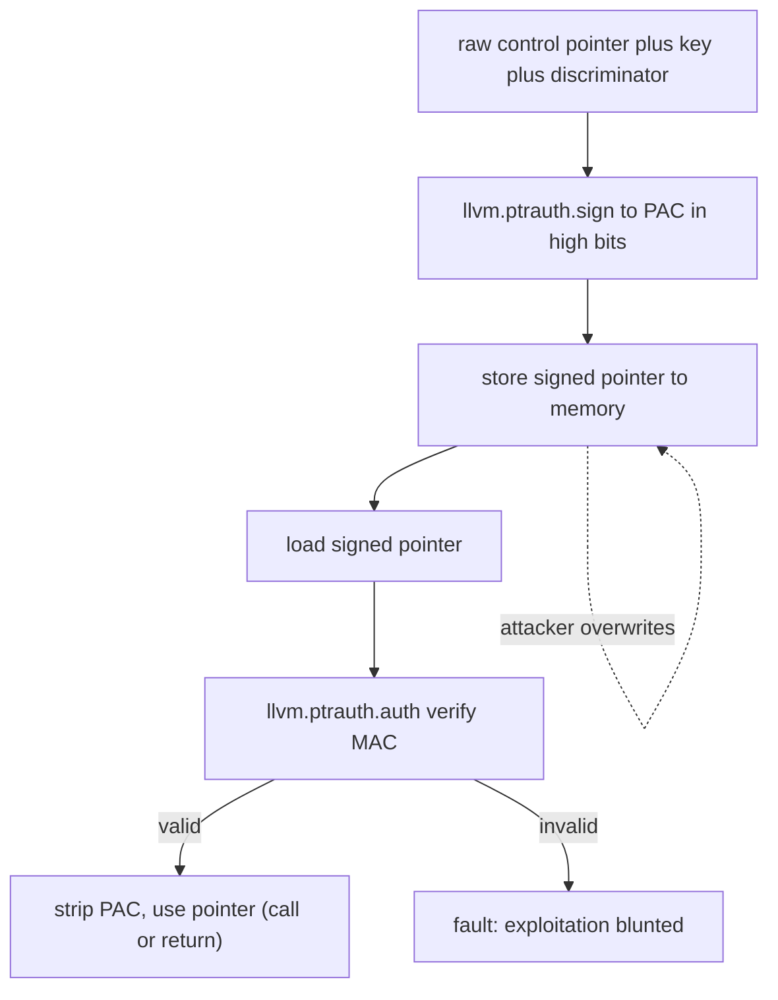

# Pointer Authentication (ptrauth / arm64e)

> 🧭 **Implementation** · `implementation · codegen · llvm+clang` · Index [[LLVM.MOC]]
> **Realizes:** [[Memory-Safety-Hardening.MOC|memory-safety]] hardening (control-flow integrity) · **Prerequisites:** [[llvm-basics]] · **Complements:** [[fbounds-safety]], [[safe-buffers]]

> [!abstract] What this note adds
> The **hardware-backed** pillar of LLVM's memory-safety hardening: a **mitigation, not an analysis**. It signs control-relevant pointers (return addresses, function pointers, vtable entries) with a short **cryptographic MAC — the PAC — stored in the otherwise-unused high bits of a 64-bit pointer**, and **verifies that MAC before the pointer is used**. A corrupted or substituted pointer fails authentication and faults, blunting **ROP/JOP** exploitation. It rides a clean **three-layer lowering** — Clang qualifier/builtins → LLVM `llvm.ptrauth.*` intrinsics → AArch64 `PAC*`/`AUT*` instructions — and is the mechanism under Apple's **arm64e** ABI.

---

## 1. The pass

Pointer authentication is not a single pass but a **codegen feature** threaded through Clang IR-gen and the AArch64 backend. The Clang entry point is `clang/lib/CodeGen/CGPointerAuth.cpp` — whose file comment describes *"common routines relating to the emission of pointer authentication operations"* — which emits the sign/auth/blend operations. It realizes a slice of [[Memory-Safety-Hardening.MOC|memory safety]] that the software checkers can't reach: **integrity of the control pointers themselves**, enforced by hardware rather than by an inserted `icmp`.

The core idea is a keyed MAC over a pointer. When a control pointer is produced (stored, materialized) it is **signed**; when it is consumed (loaded, called, returned through) it is **authenticated**. Because the signature depends on a secret key held in a CPU register and on a per-site **discriminator**, an attacker who overwrites the pointer in memory cannot forge a valid signature, so the authenticate step faults instead of transferring control.

## 2. What it realizes (and why promoted)

- **Control-flow integrity, cheaply and in hardware.** Return addresses and indirect-call targets are the currency of ROP/JOP; signing them means a swapped pointer no longer authenticates. This is a *probabilistic* defence (the PAC is a few dozen bits, not a full block), but it raises exploitation cost sharply at near-zero code size.
- **A distinct pillar from the software checks.** [[fbounds-safety]] and [[safe-buffers]] harden **spatial** access (bounds of buffers); ptrauth hardens **pointer integrity** (was this control pointer tampered with?). They are orthogonal and composable — one guards *what you index*, the other guards *where control flows*.

It gets its own note because the mechanism is a **three-layer lowering** that no single concept note owns, and because it is the substrate of an entire ABI (arm64e).

## 3. Where it runs

- **In Clang IR-gen**, whenever a `__ptrauth`-qualified value is loaded/stored, a `__builtin_ptrauth_*` is used, or an ABI schema (arm64e / the PAuth ELF ABI) mandates signing (vtable pointers, function pointers, return addresses). `CGPointerAuth.cpp` emits the intrinsic calls.
- **In the AArch64 backend**, where the `llvm.ptrauth.*` intrinsics and pseudo-nodes (`PAC`, `MOVaddrPAC`, `LOADgotPAC`) lower to real ARMv8.3-A instructions. The hardening/expansion lives in `llvm/lib/Target/AArch64/AArch64PointerAuth.cpp` and `AArch64ISelLowering.cpp`.
- It is **ABI/target-gated**, not an `-O`-level pass: it fires when the target (e.g. `arm64e-apple-*`) or an explicit `-fptrauth-*` flag turns it on.

## 4. How it's built — the three-layer lowering

The whole feature is one idea expressed at three altitudes. Each layer only knows about the one below it.

> [!info] Concept → layer → confirming source
>
> | Concept | Clang surface (source) | LLVM IR (intrinsic) | AArch64 instruction |
> |---|---|---|---|
> | **Sign** a raw pointer | `__ptrauth(key, addr_disc, disc)` qualifier — store triggers a sign (`Attr.td`: `CustomKeyword<"__ptrauth">`); `__builtin_ptrauth_sign_unauthenticated` | `llvm.ptrauth.sign(i64 val, i32 key, i64 disc)` | `PAC*` (e.g. `PACIA`, `PACDA`) |
> | **Authenticate** before use | qualified load; `__builtin_ptrauth_auth` | `llvm.ptrauth.auth` (signature *must* be valid) | `AUT*` (e.g. `AUTIA`) |
> | **Auth-then-resign** (schema change) | `__builtin_ptrauth_auth_and_resign` | `llvm.ptrauth.resign` | `AUT*` + `PAC*` |
> | **Strip** the signature | `__builtin_ptrauth_strip` | `llvm.ptrauth.strip` | `XPAC*` |
> | **Blend** a small integer into an address discriminator | `__builtin_ptrauth_blend_discriminator` (`EmitPointerAuthBlendDiscriminator`) | `llvm.ptrauth.blend` | (integer mix, folded into the disc operand) |
> | **Sign generic data** (returns a signature value) | `__builtin_ptrauth_sign_generic_data` | `llvm.ptrauth.sign_generic` | `PACGA` |

The Clang side in `CGPointerAuth.cpp` computes the *discriminator* for each site and calls the intrinsic: e.g. `EmitPointerAuthBlendDiscriminator` materializes `CGM.getIntrinsic(llvm::Intrinsic::ptrauth_blend)`. The backend then selects the concrete `PAC`/`AUT` opcode from the **key** operand.

**Keys + discriminators.** A signature is a MAC over `(pointer, key, discriminator)`:

- **Keys** — hardware keys select *which* signature scheme. Clang's `ARM8_3Key` enum (`PointerAuthOptions.h`) names the **four pointer keys** — `ASIA/ASIB` (instruction, keys A/B) and `ASDA/ASDB` (data, keys A/B) — matching the `IA/IB/DA/DB` instruction suffixes. A separate **generic** key drives the `PACGA` instruction (`llvm.ptrauth.sign_generic`) for signing arbitrary data, but it is **not** a member of that enum. Instruction keys sign code pointers, data keys sign data pointers, so a signed return address can't be re-used as a signed data pointer.
- **Discriminator** — a 64-bit "salt" that diversifies signatures so the same pointer signed at two sites gets two different MACs. It combines a **compile-time constant** (often a hash of the pointee's *type* or *decl* — `getPointerAuthTypeDiscriminator` / `getPointerAuthDeclDiscriminator`) with an optional **address discriminator** (the storage slot's address), mixed by `llvm.ptrauth.blend`. Address discrimination ties a signature to *where the pointer lives*, so it can't be copied elsewhere and still authenticate.

**Figure — sign at store, authenticate before use.** The MAC lives in the pointer's high bits; tamper in memory and the auth faults.



The reading: signing happens once when the pointer is produced; every consumer re-derives the MAC and compares. Only an attacker who knows the secret key *and* the per-site discriminator could forge a pointer that survives step `A`.

## 5. Textbook → LLVM (deviations)

> [!info]+ Idealized MAC-on-pointer vs. what ptrauth ships
>
> | Idealized scheme | LLVM / arm64e reality |
> |---|---|
> | Full-width cryptographic MAC alongside each pointer | A **short PAC packed into the pointer's unused high bits** — no extra storage, but only a few dozen bits of signature (probabilistic, brute-forceable in principle) |
> | Sign *every* pointer | Sign only **control-relevant** pointers by ABI schema (return addr, function ptr, vtable, some data ptrs); leaf data is untouched |
> | One global key | **Five keys** (I/D × A/B, plus generic) + per-site **discriminators** to prevent signature substitution across roles and sites |
> | Software MAC in the compiler | **Hardware instructions** (`PAC*`/`AUT*`, ARMv8.3-A); the compiler only decides *what* to sign and *with which discriminator* |

## 6. Run it yourself

> [!example]+ See the intrinsics and instructions
> ```bash
> # A function-pointer sign/auth, emitted as llvm.ptrauth.* intrinsics
> clang --target=arm64e-apple-macos -O0 -S -emit-llvm ptr.c -o -
>
> # ...and lowered to PAC*/AUT* on the arm64e target
> clang --target=arm64e-apple-macos -O2 -S ptr.c -o -
> ```
> ```c
> // ptr.c — a __ptrauth-qualified function pointer
> typedef void (*fp_t)(void);
> // key ASIA (0), address-discriminated (1), extra discriminator 42
> fp_t __ptrauth(0, 1, 42) g;
> void call(void) { g(); }   // load g -> llvm.ptrauth.auth -> AUTIA -> BR
> ```
> The IR shows `@llvm.ptrauth.auth` guarding the load before the indirect call; the asm shows an `AUT*` (or a combined authenticated branch). Exact output is target-/version-dependent — run it to see the real form.

## 7. Flags & knobs

- **Target-driven:** an `arm64e-apple-*` triple enables the Apple ABI schema wholesale. Upstream, the `-fptrauth-*` family (`-fptrauth-returns`, `-fptrauth-calls`, `-fptrauth-vtable-pointers`, `-fptrauth-intrinsics`, …) toggles individual schemas for the vendor-neutral PAuth ABI.
- **Related but distinct:** `-mbranch-protection=pac-ret` (return-address signing) predates the full ptrauth ABI and is a lighter, portable subset handled by `AArch64PointerAuth.cpp`.
- The `__ptrauth(key, address_discrimination, extra_discriminator)` qualifier takes **1–3 arguments** (Clang diagnoses otherwise) and applies to pointer or pointer-sized-integer types.

## 8. Siblings & variants

- **[[fbounds-safety]]** / **[[safe-buffers]]** — the **software, spatial** side of the same hardening story; ptrauth is the **hardware, control-integrity** side. Position ptrauth as their hardware-backed complement, not a replacement.
- **`-mbranch-protection=bti`** (Branch Target Identification) — a *separate* ARMv8.5 CFI feature often paired with pac-ret; it restricts indirect-branch *landing pads* rather than signing pointers. Complementary.
- **PAuthLR** — a newer variant that also binds the return-address signature to the call site's PC (handled in `AArch64PointerAuth.cpp`).

## 9. Limitations & version notes

> [!warning] What it does and doesn't buy you
> - **Probabilistic, not cryptographically total.** The PAC is only the pointer's spare high bits — a few dozen bits — so a signature can in principle be brute-forced, and a signing *gadget* left reachable to an attacker weakens the scheme. It **raises cost**; it is not a proof of control-flow integrity.
> - **Hardware-gated.** The `PAC*`/`AUT*` instructions require **ARMv8.3-A**. On older cores the instructions are `NOP`-space hints (so binaries still run, unprotected) rather than enforcing.
> - **Scope is control pointers.** By default only ABI-designated pointers are signed; arbitrary heap data pointers are not, so it does nothing for spatial bugs — that's the [[fbounds-safety]]/[[safe-buffers]] job.
> - **Version-/target-sensitive.** Exact schemas, flags, and the arm64e ABI shape evolve; treat specifics as pinned to the tracked release → [[llvm-version]].

> [!summary] The one thing to remember
> Pointer authentication is a **hardware-backed mitigation**: it stamps control pointers (return addresses, function/vtable pointers) with a keyed **PAC** in their unused high bits, and **re-verifies that PAC before every use**, so a tampered pointer faults instead of redirecting control — lowered through **three layers** (`__ptrauth`/`__builtin_ptrauth_*` → `llvm.ptrauth.sign`/`auth`/`resign`/`blend` → AArch64 `PAC*`/`AUT*`), and shipped as Apple's **arm64e** ABI (and the vendor-neutral PAuth ELF ABI). It is the control-integrity pillar that complements the software, spatial hardening of [[fbounds-safety]]/[[safe-buffers]].

> [!quote] Sources & confidence
> - **Tier-1 source (pinned tag):** [`clang/lib/CodeGen/CGPointerAuth.cpp`](https://github.com/llvm/llvm-project/blob/llvmorg-22.1.8/clang/lib/CodeGen/CGPointerAuth.cpp) — read directly: `EmitPointerAuthBlendDiscriminator` → `llvm::Intrinsic::ptrauth_blend`, the type/decl discriminator helpers. The `__ptrauth` keyword ([`clang/include/clang/Basic/Attr.td`](https://github.com/llvm/llvm-project/blob/llvmorg-22.1.8/clang/include/clang/Basic/Attr.td), `CustomKeyword<"__ptrauth">`), the `__builtin_ptrauth_*` set ([`Builtins.td`](https://github.com/llvm/llvm-project/blob/llvmorg-22.1.8/clang/include/clang/Basic/Builtins.td)), and the `ARM8_3Key` enum `ASIA/ASIB/ASDA/ASDB` ([`PointerAuthOptions.h`](https://github.com/llvm/llvm-project/blob/llvmorg-22.1.8/clang/include/clang/Basic/PointerAuthOptions.h)) were all confirmed in tree.
> - **IR layer:** the `llvm.ptrauth.sign / auth / resign / strip / blend / sign_generic` intrinsics confirmed in [`llvm/include/llvm/IR/Intrinsics.td`](https://github.com/llvm/llvm-project/blob/llvmorg-22.1.8/llvm/include/llvm/IR/Intrinsics.td) (they are **generic**, not AArch64-specific — the "Pointer Authentication Intrinsics" section). Backend lowering (`PAC`/`MOVaddrPAC`/`LOADgotPAC` nodes, `AUT*`) confirmed in [`AArch64ISelLowering.cpp`](https://github.com/llvm/llvm-project/blob/llvmorg-22.1.8/llvm/lib/Target/AArch64/AArch64ISelLowering.cpp) and [`AArch64PointerAuth.cpp`](https://github.com/llvm/llvm-project/blob/llvmorg-22.1.8/llvm/lib/Target/AArch64/AArch64PointerAuth.cpp).
> - **arm64e:** confirmed as an in-tree AArch64 sub-arch (`AArch64SubArch_arm64e`, triple parsing in `TargetParser`). Primary doc: [Clang — Pointer Authentication](https://clang.llvm.org/docs/PointerAuthentication.html) (the ABI-level "PAC in high bits / arm64e" narrative; the `clang/docs/PointerAuthentication.rst` file was **not present** in this shallow checkout, so the ABI-level claims below lean on the published doc).
> - The **arm64e shipping timeline** (A12 / 2018, upstreamed from 2019) and the "few-dozen-bit, probabilistic MAC" framing are from Apple/Arm design write-ups, not read from source at this tag:
>   > [!danger] Unverified
>   > The exact PAC bit-width, the arm64e ship date (A12/2018) and upstreaming date (2019), and "ABI-agnostic / vendor-neutral PAuth ELF ABI" status are **not confirmed against tier-1 source** in this checkout (the `.rst` ABI doc was absent). Verify against the Clang Pointer Authentication doc / Arm ARM before relying on the specifics.
