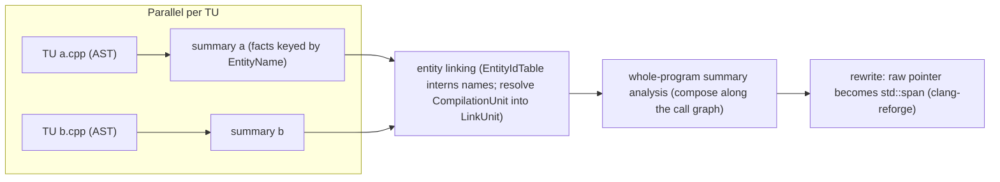

# Scalable Static Analysis Framework (SSAF)

> 🧭 **Implementation** · `implementation · analysis · clang` · Index [[LLVM.MOC]]
> **Realizes:** [[interprocedural-summaries|summary-based interprocedural analysis]] · **Prerequisites:** [[interprocedural-summaries]], [[call-graph]] · **Consumes:** the Clang AST (per-TU), [[pointer-alias-analysis|pointer/aliasing]] facts (for the taint use case) · **See also:** [[safe-buffers]]

> [!abstract] What this note adds
> The engineering specifics of Clang's emerging **"ThinLTO for static analysis"** framework (namespace `clang::ssaf`, `clang/lib/Analysis/Scalable`): a **three-stage** compositional pipeline — per-TU **summary extraction** → cross-TU **entity linking** → **whole-program summary analysis** — that ports ThinLTO's *compile → thin-link → use* shape from codegen to **whole-program C/C++ hardening**. Only the **entity model** (the naming/interning layer that makes cross-TU linking possible) is in-tree at the pinned tag; the summary, analysis, and rewrite stages are RFC-stage and landing incrementally.

---

## 1. The component

An in-progress framework for **whole-program, summary-based** static analysis of C/C++, living under `clang/lib/Analysis/Scalable` (public headers under `clang/include/clang/Analysis/Scalable`), all in namespace `clang::ssaf`. It is the concrete realization the concept note [[interprocedural-summaries]] calls "the Scalable Static Analysis Framework (emerging)": each translation unit is analyzed **once** into a summary keyed by a stable name, summaries are **linked** across TUs, and a whole-program pass then composes them. The design goal is to make interprocedural bug-finding and **automated hardening** scale the way ThinLTO made link-time *optimization* scale — parallel per-TU work, a small serial link, and incrementality.

At the pinned tag the in-tree code is the **entity model** — the layer that gives every program entity a name that is stable across compilation boundaries, so a summary produced in TU *A* can be joined to a use in TU *B*. The rest of the pipeline (summary builders, the whole-program analysis, and the source rewriter) is described in the RFC and is landing incrementally (§7).

## 2. What it realizes (and why promoted)

It realizes [[interprocedural-summaries|summary-based (compositional) interprocedural analysis]] — the *functional/summary* strategy of Sharir & Pnueli, not call-strings — specialized to **cross-TU** C/C++ where the callee's body may live in a separately compiled translation unit. It gets its own note (rather than a row in the concept table) because the **entity model is a real, verifiable in-tree artifact** with its own naming/interning design, and because the motivating application — **memory-safety migration at whole-codebase scale** — is what distinguishes SSAF from the existing ThinLTO / function-attrs / IPSCCP summary realizations, which summarize for *optimization*, not for *hardening rewrites*.

The concrete driving use case is a **backward taint analysis on pointer types**: starting from an operation that needs a bound (e.g. an indexed access), propagate a "needs a size" fact backward through the call graph across TUs to every raw pointer that reaches it, so an automated rewrite can convert those raw-pointer APIs to `std::span`. This **generalizes [[safe-buffers]]** (the `-Wunsafe-buffer-usage` Fix-It machinery): [[safe-buffers]] emits **per-function** Fix-Its within a single TU, whereas SSAF aims to compose summaries so the same class of rewrite can be applied **coherently across the whole codebase** — every caller and callee of an entity, wherever compiled.

## 3. Where it runs

- **Not** part of `-O2` codegen and **not** (yet) a `clang --analyze` checker package. SSAF is a standalone whole-program pipeline layered on the Clang AST.
- Conceptually it slots **before** ThinLTO's IR-level work: it reasons at the **AST/source** level (so it can drive **source rewrites**, which IR-level ThinLTO cannot), TU-by-TU, then links.
- The three stages (extract → link → analyze) mirror ThinLTO's *compile → thin-link → optimize*; see the figure in §5.

## 4. How it's built — the entity model (in-tree, verified)

The problem the entity model solves: a summary is only composable if both sides agree on **what entity** a fact is about, and that agreement must survive separate compilation. SSAF's answer is a globally-stable **`EntityName`**, interned to a cheap **`EntityId`**, scoped by a **`BuildNamespace`**, and produced from the AST by **`ASTEntityMapping`**.

> [!info] Concept → class → confirming header
>
> | Role | Class / enum (`clang::ssaf`) | Header (confirmed in-tree) |
> |---|---|---|
> | Globally-unique, cross-boundary entity identifier | `EntityName` | `Model/EntityName.h` — doc: *"a globally unique identifier for program entities that remains stable across compilation boundaries … enables whole-program analysis to track and relate entities across separately compiled translation units."* Built from a **USR** (`std::string USR`) + a `Suffix` + a `NestedBuildNamespace` |
> | Lightweight opaque handle (index-based) | `EntityId` | `Model/EntityId.h` — *"lightweight opaque handle … index-based for efficient comparison and lookup"*; internally a `size_t Index`, no public ctor |
> | Interning table `EntityName → EntityId` | `EntityIdTable` | `Model/EntityIdTable.h` — maps each unique `EntityName` to exactly one `EntityId`; `getId` is idempotent; *"Entities are never removed."* |
> | Build-graph scoping (which TU / link unit an entity belongs to) | `BuildNamespaceKind` = `{ CompilationUnit, LinkUnit }`, `BuildNamespace`, `NestedBuildNamespace` | `Model/BuildNamespace.h` — a `NestedBuildNamespace` is an ordered sequence modeling "first part of a compilation unit, then incorporated into a link unit" |
> | AST decl → `EntityName` mapping | `getEntityName(const Decl*)`, `getEntityNameForReturn(const FunctionDecl*)` | `ASTEntityMapping.h` — maps **functions & methods, global variables, function parameters, struct/class/union type definitions, and struct/class/union fields**; implicit decls & builtins are not mapped |
> | Name of an analysis summary (the key to refer to / build an analysis) | `SummaryName` | `Model/SummaryName.h` — *"uniquely identifies an analysis summary … the key to refer to an analysis or to name a builder to build an analysis."* |

Two implementation details worth pinning, both read from `ASTEntityMapping.cpp`:

- **`EntityName` is built from a USR.** `getEntityName` calls `clang::index::generateUSRForDecl` and wraps the result; a **function parameter** reuses its parent function's USR with the **1-based parameter index** as the `Suffix`, and the **return entity** uses `Suffix = "0"`. The header explicitly warns client code *not* to assume USRs — it is an implementation detail behind `EntityName`.
- **The compilation-id scoping exists but is not yet wired into the AST mapper.** `BuildNamespace::makeCompilationUnit(CompilationId)` / `NestedBuildNamespace::makeCompilationUnit` construct a `CompilationUnit` namespace, but at the pinned tag `getEntityName` constructs the `EntityName` with an **empty** namespace (`{}`). So the *mechanism* for per-CU/per-link-unit qualification is present; **stamping every AST-derived name with its compilation id is still being wired up** (consistent with the framework being WIP).

## 5. The three-stage pipeline

**Figure — extract per TU, link across TUs, then analyze whole-program.** The extract step is parallel and incremental (like ThinLTO's per-module compile); only the link/merge is whole-program.



The reading: **stage 1** turns each TU's AST into a summary whose facts are keyed by `EntityName`; **stage 2** interns those names in a shared `EntityIdTable` and resolves each `CompilationUnit` namespace into the enclosing `LinkUnit`, so a name minted in one TU matches the same entity seen in another; **stage 3** composes the linked summaries across the [[call-graph]] to a whole-program result, which the rewriter then applies to source. In this note's terms, stages 1–2 correspond to the **verified** entity model; stage 3 and the rewrite are **RFC-stage** (§7).

## 6. Run it yourself

> [!example] Inspect the in-tree surface (what actually exists today)
> ```bash
> # the only in-tree code at the pinned tag is the entity model:
> ls clang/lib/Analysis/Scalable clang/lib/Analysis/Scalable/Model
> ls clang/include/clang/Analysis/Scalable clang/include/clang/Analysis/Scalable/Model
> # unit tests exercise EntityName / EntityIdTable / BuildNamespace / ASTEntityMapping:
> ls clang/unittests/Analysis/Scalable 2>/dev/null
> ```
> There is **no end-user driver yet** — you cannot run `clang --analyze --ssaf` to migrate pointers to `std::span`. The library is present; the pipeline and rewriter that would make it a user-facing tool are still landing (§7).

## 7. Limitations & version notes

> [!warning] Work-in-progress — separate "in-tree" from "RFC-proposed"
> - **Only the entity model is in-tree** at the pinned tag: `EntityName`, `EntityId`/`EntityIdTable`, `BuildNamespace`/`NestedBuildNamespace`, `SummaryName`, and `ASTEntityMapping` (all confirmed from the headers/`.cpp` in §4). These names and their documented semantics are what you can rely on today.
> - **RFC-stage / not yet in-tree** (design lives in the RFC, not code): the per-TU **summary builders**, the cross-TU **entity-linking driver**, the **whole-program summary analysis**, the **backward pointer-taint** analysis that drives the `std::span` migration, and the **clang-reforge** source rewriter that applies the resulting Fix-Its. Treat every claim about these stages as *proposed behavior*, not verified in-tree behavior.
> - **Compilation-id scoping is only half-wired** (§4): the `CompilationUnit`/`LinkUnit` machinery exists, but `getEntityName` does not yet stamp names with their compilation id.
> - **Version-sensitive** by nature — the framework's maturity is a moving target; this note is pinned to [[llvm-version]] and marked `status: needs-review` precisely because much of the design is still RFC-only. Re-verify what has landed on any version bump.

> [!summary] The one thing to remember
> SSAF (`clang::ssaf`, `clang/lib/Analysis/Scalable`) is **"ThinLTO for static analysis"**: a three-stage *extract → link → analyze* compositional pipeline whose in-tree foundation is an **entity model** — a cross-boundary-stable **`EntityName`** (from a USR), interned to an **`EntityId`**, scoped by a `CompilationUnit`/`LinkUnit` **`BuildNamespace`**, mapped from AST decls (incl. **fields**) by `ASTEntityMapping` — built to drive whole-codebase memory-safety rewrites (raw pointer → `std::span`) that generalize [[safe-buffers]]' per-function Fix-Its. Only the entity model has landed; the summary/analysis/rewrite stages are RFC-stage.

> [!quote] Sources & confidence
> **Confirmed in-tree (tier-1, pinned tag / current `main`):** the entity-model claims in §4 were read directly from these files.
> - [`clang/lib/Analysis/Scalable`](https://github.com/llvm/llvm-project/tree/main/clang/lib/Analysis/Scalable) — the directory (`ASTEntityMapping.cpp`, `Model/`).
> - [`ASTEntityMapping.h`](https://github.com/llvm/llvm-project/blob/main/clang/include/clang/Analysis/Scalable/ASTEntityMapping.h) · [`Model/EntityName.h`](https://github.com/llvm/llvm-project/blob/main/clang/include/clang/Analysis/Scalable/Model/EntityName.h) · [`Model/EntityId.h`](https://github.com/llvm/llvm-project/blob/main/clang/include/clang/Analysis/Scalable/Model/EntityId.h) · [`Model/EntityIdTable.h`](https://github.com/llvm/llvm-project/blob/main/clang/include/clang/Analysis/Scalable/Model/EntityIdTable.h) · [`Model/BuildNamespace.h`](https://github.com/llvm/llvm-project/blob/main/clang/include/clang/Analysis/Scalable/Model/BuildNamespace.h) · [`Model/SummaryName.h`](https://github.com/llvm/llvm-project/blob/main/clang/include/clang/Analysis/Scalable/Model/SummaryName.h).
>
> **RFC-proposed (not yet verifiable in-tree — treat as design intent):** the three-stage pipeline, cross-TU linking driver, whole-program analysis, pointer-taint → `std::span` migration, and the rewriter.
> - SSAF RFC: [RFC — Scalable Static Analysis Framework](https://discourse.llvm.org/t/rfc-scalable-static-analysis-framework/88678).
> - Rewriter RFC: [RFC — clang-reforge](https://discourse.llvm.org/) (the source-rewriting tool that would apply SSAF's Fix-Its).
>
> > [!danger] Unverified
> > The specific discourse URL for the **clang-reforge** RFC and the exact division of labor between SSAF and clang-reforge are **not confirmed against a primary source** here — the clang-reforge link above is a placeholder. Confirm the thread and the rewriter's scope before promoting `status` above `needs-review`.
