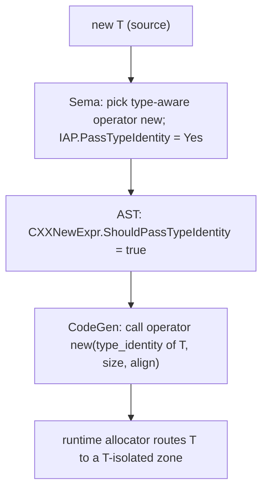

# Type-Aware Allocation (typed allocators)

> 🧭 **Implementation** · `implementation · frontend · clang` · Index [[LLVM.MOC]]
> **Realizes:** [[Memory-Safety-Hardening.MOC|memory safety]] (temporal / type-confusion hardening) · **Prerequisites:** [[clang-ast|Clang AST]] · **Siblings:** [[fbounds-safety]], [[pointer-authentication]], [[safe-buffers]]

> [!abstract] What this note adds
> The C++ language feature `cxx_type_aware_allocators` (WG21 **P2719**) where an `operator new` / `operator delete` overload receives the **allocated type** — passed as a `std::type_identity<T>` tag as its first parameter — so the allocator *knows the type it is allocating* at the call site. This is the **compiler half** of a **type-isolating allocator**: given the type, a runtime allocator can segregate objects by type into separate zones, which is the mechanism that makes use-after-free / type-confusion exploitation unreliable. The note covers how Clang **resolves** the type-aware overload (Sema) and **lowers** it (CodeGen), and marks clearly what lives outside the LLVM tree (the runtime allocators themselves).

---

## 1. The feature

`cxx_type_aware_allocators` — a Clang language extension implementing WG21 **P2719** ("Type-aware allocation and deallocation functions"). It is advertised as an extension in [`clang/include/clang/Basic/Features.def:388`](https://github.com/llvm/llvm-project/blob/main/clang/include/clang/Basic/Features.def) — `EXTENSION(cxx_type_aware_allocators, true)` (confirmed at the pinned tag).

Ordinarily an allocation function has the shape `operator new(std::size_t)` — the allocator sees only a byte count. A **type-aware** overload instead takes a leading `std::type_identity<T>` tag: `operator new(std::type_identity<T>, std::size_t, std::align_val_t)`. The template argument `T` is exactly the type being allocated, so the allocator can specialize behaviour per type (or per type-family) rather than treating every request as anonymous bytes. This note documents the *compiler* that resolves and threads that type; it realizes the [[Memory-Safety-Hardening.MOC|memory-safety]] concept as the front-end enabler of type-isolating allocation.

## 2. What it realizes (and why promoted)

It gets its own note because it is the **third hardening pillar**, orthogonal to the two already in the vault:

- **[[fbounds-safety]]** — *spatial* safety (bounds on pointer accesses).
- **[[pointer-authentication]]** — *control-flow* integrity (signed pointers resist forging).
- **Type-aware allocation** — *temporal / type-confusion* hardening. By handing the allocator the type, it enables **type isolation**: allocations of different types never share the same backing memory, so a freed object's slot is not reused for an object of another type. A dangling pointer of type `A` can then no longer be made to point at a live `B`, which is the core of use-after-free and type-confusion exploit primitives.

The compiler alone does **not** make anything safe — it only *carries the type to the allocator*. Whether that yields isolation depends on the runtime `operator new` an implementation links in (see §6).

## 3. Where it runs

Purely a **front-end** feature — it acts during **semantic analysis + IR generation of a `new`/`delete` expression**, before the optimizer. There is no pass-pipeline slot; nothing in `opt` participates. The flow is:

1. **Sema** (`SemaExprCXX.cpp`) — while building a `CXXNewExpr`, overload resolution decides whether a type-aware allocation/deallocation overload is viable and selected.
2. **AST** (`ExprCXX.cpp`) — the decision is recorded as a bit on the `CXXNewExpr`.
3. **CodeGen** (`CGExprCXX.cpp`) — when emitting the allocation call, the `std::type_identity<T>` argument is materialized and passed.

## 4. How it's built

**Sema — selecting the overload.** When Clang builds a `new` expression it computes an `ImplicitAllocationParameters` (`IAP`) whose `PassTypeIdentity` field records whether the type-aware form applies; the seed comes from `ShouldUseTypeAwareOperatorNewOrDelete()` (`SemaExprCXX.cpp:2432`). During `FindAllocationFunctions`, a candidate declared with `isTypeAwareOperatorNewOrDelete()` is matched by *reconstructing the expected tag*: `tryBuildStdTypeIdentity(AllocType, Loc)` builds `std::type_identity<AllocType>` and the candidate's first parameter must be that exact type (`SemaExprCXX.cpp:1792–1803`), otherwise it is rejected. The selected `PassTypeIdentity` then drives whether an extra implicit argument is expected when the call is assembled (`SemaExprCXX.cpp:2470–2471`, guarded by `isTypeAwareAllocation`).

**AST — recording the decision.** The result is stashed on the node: `CXXNewExprBits.ShouldPassTypeIdentity = isTypeAwareAllocation(IAP.PassTypeIdentity)` (`ExprCXX.cpp:250–251`). CodeGen reads this rather than re-deriving it.

**CodeGen — passing the type.** When emitting the allocator call, if `isTypeAwareAllocation(IAP.PassTypeIdentity)` holds, CodeGen takes the allocator's first parameter type (a `std::type_identity<T>` specialization), value-initializes it (`CXXScalarValueInitExpr`), and prepends it to the argument list: `allocatorArgs.add(TypeIdentityArg, SpecializedTypeIdentity)` (`CGExprCXX.cpp:1627–1632`). The symmetric path for `operator delete` adds the same tag as the delete's first argument (`CGExprCXX.cpp:1447–1451`, `:1822–1823`). Because `std::type_identity<T>` is an empty tag type, this is a **compile-time** type channel: the type is encoded in the *overload chosen and the argument type*, carrying essentially no runtime cost.

> [!info] Concept → where confirmed (pinned tag `llvmorg-22.1.8`)
>
> | Fact | Where confirmed |
> |---|---|
> | Feature exists / on by default | `Features.def:388` — `EXTENSION(cxx_type_aware_allocators, true)` |
> | Sema decides type-aware overload applies | `SemaExprCXX.cpp:2432` — `ShouldUseTypeAwareOperatorNewOrDelete()` seeds `IAP.PassTypeIdentity` |
> | Overload matched by the `std::type_identity<T>` tag | `SemaExprCXX.cpp:1792–1803` — `tryBuildStdTypeIdentity(AllocType, …)`, compared to param 0's type |
> | Decision recorded on the AST node | `ExprCXX.cpp:250–251` — `CXXNewExprBits.ShouldPassTypeIdentity` |
> | CodeGen passes the type to the allocator | `CGExprCXX.cpp:1627–1632` (new), `:1447–1451` (delete) — adds the `type_identity<T>` argument |

**Figure — the type flows from `new T` to the allocator.** The allocated type is resolved in Sema, recorded on the AST, and emitted as a `type_identity<T>` argument so the allocator can route the request to a per-type zone.

The reading: Clang's only job is steps B–D — resolve, record, pass. Step E (the isolation) is the runtime allocator's job and is not in the LLVM tree (§6).

## 5. Textbook → LLVM (what's the deviation)

> [!info]+ Ordinary allocation vs. type-aware allocation
> | Ordinary `operator new` | Type-aware `operator new` |
> |---|---|
> | Signature `(size_t [, align_val_t])` — allocator sees only bytes | Leading `std::type_identity<T>` tag — allocator sees the **type** |
> | Allocation is anonymous; a freed slot can back **any** later type | The allocator *can* segregate by type → freed slot reused only by the **same** type |
> | Overload resolution ignores the allocated type | Sema reconstructs `std::type_identity<AllocType>` and requires the parameter to match exactly |

The tag type is empty, so the "extra argument" is a **static** type channel, not a runtime payload — the type is communicated by *which overload was chosen*, not by bytes passed.

## 6. Where the runtime lives (background — not in the LLVM tree)

> [!warning] The compiler is only half the story
> Type-aware allocation is the *language/compiler* mechanism. The **isolation policy** — actually placing different types in different memory zones — lives in the **runtime allocator and OS**, which are **not** part of LLVM. The known realizations are Apple-platform:
>
> - **`kalloc_type`** in the XNU kernel — type-segregated kernel heap.
> - **xzone malloc** — the userland type-/zone-segregating allocator.
> - **WebKit `libpas`** (the `isoheap` mechanism) — isolated heaps per type in the browser engine.
>
> These consume the `std::type_identity<T>` the compiler passes (or an equivalent type key) to route allocations. Treat this paragraph as *context for why the compiler feature exists*, not as an LLVM claim.

> [!danger] Unverified
> The specific behaviour of **`kalloc_type`** (XNU), **xzone malloc**, and WebKit **`libpas`** — and the precise interface by which they consume the type — was **not** verified against primary sources for this note; those components are outside the LLVM/Clang tree that this vault verifies at tier 1. They are named here only as the runtime motivation for the compiler feature. Verify against Apple/WebKit primary sources before relying on any specific claim about them.

## 7. Siblings & variants

- **[[fbounds-safety]]** — spatial-safety sibling (bounds checks). A note in this vault; complementary axis.
- **[[pointer-authentication]]** — control-flow-integrity sibling (signed pointers).
- **[[safe-buffers]]** — the `-Wunsafe-buffer-usage` / hardened-container front-end effort; another spatial-safety lever.
- Together these are the **hardening pillars**: type-aware allocation is the **temporal / type-confusion** one.

## 8. Limitations & version notes

> [!warning] What it does and doesn't do
> - **Compiler-side only.** It resolves and passes the type; it enforces **no** isolation by itself. With an ordinary `operator new`, a type-aware overload is functionally an ordinary allocation with an ignored tag.
> - **Requires a cooperating runtime.** The safety benefit exists only when linked against a type-isolating allocator (§6), which on today's evidence is Apple-platform.
> - **Extension, on by default in Clang.** `EXTENSION(cxx_type_aware_allocators, true)` marks it a Clang extension (as of the pinned tag); it tracks WG21 P2719, whose final wording may still evolve. Version-check on a bump.

> [!summary] The one thing to remember
> Type-aware allocation (P2719, `cxx_type_aware_allocators`) makes Clang **pass the allocated type** — as a `std::type_identity<T>` tag — into `operator new`/`operator delete`: Sema selects the type-aware overload and CodeGen emits the tag argument. That's the **compiler half** of a **type-isolating allocator**, the *temporal / type-confusion* hardening pillar alongside [[fbounds-safety]] (spatial) and [[pointer-authentication]] (control-flow); the isolation itself lives in runtime allocators (kalloc_type / xzone / libpas) that are **not** in the LLVM tree.

> [!quote] Sources & confidence
> - **Tier-1 source (verified at pinned tag `llvmorg-22.1.8`):**
>   - Feature flag — [`clang/include/clang/Basic/Features.def`](https://github.com/llvm/llvm-project/blob/main/clang/include/clang/Basic/Features.def) (`EXTENSION(cxx_type_aware_allocators, true)`, line 388).
>   - Overload resolution — [`clang/lib/Sema/SemaExprCXX.cpp`](https://github.com/llvm/llvm-project/blob/main/clang/lib/Sema/SemaExprCXX.cpp) (`ShouldUseTypeAwareOperatorNewOrDelete`, `tryBuildStdTypeIdentity`, `PassTypeIdentity`).
>   - AST bit — [`clang/lib/AST/ExprCXX.cpp`](https://github.com/llvm/llvm-project/blob/main/clang/lib/AST/ExprCXX.cpp) (`ShouldPassTypeIdentity`).
>   - Lowering — [`clang/lib/CodeGen/CGExprCXX.cpp`](https://github.com/llvm/llvm-project/blob/main/clang/lib/CodeGen/CGExprCXX.cpp) (adds the `std::type_identity<T>` argument for new/delete).
>   Line numbers read directly from the raw files at the pinned tag; the `blob/main/…` links may drift by a few lines on newer commits.
> - **Design / spec:** WG21 **P2719** — "Type-aware allocation and deallocation functions."
> - **Runtime context (NOT verified here — see the `[!danger]` note):** Apple `kalloc_type` (XNU), xzone malloc, WebKit `libpas` isoheaps.
