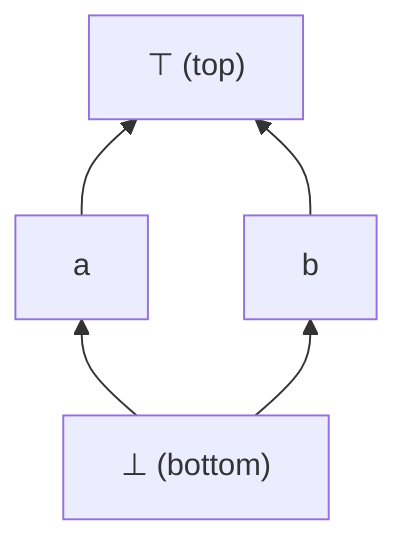

# Foundations of Data-Flow Analysis

> 🧭 **Theory** · `theory · analysis · general` · Index [[LLVM.MOC]] · see also [[dragon-book-ch9.MOC|Dragon Ch.9]]
> **Applied in:** [[data-flow-analysis]] · **Instantiated by:** [[value-numbering]] (and SCCP, ranges)

> [!abstract] Chapter map
> The lattice-theoretic skeleton every concrete [[data-flow-analysis|dataflow analysis]] hangs on: a **lattice** of facts, a **monotone** transfer function, a **meet/join**, and the guarantee that **iteration reaches a fixpoint**. This is the "why it works (and terminates)" layer — tool-agnostic, then connected to how LLVM uses it.

> [!info] The framework
> A monotone dataflow framework is $(L, \sqsubseteq, \sqcap, F)$: a **lattice** $L$ of facts ordered by $\sqsubseteq$ (more precise $\sqsubseteq$ less precise), a **meet** $\sqcap$ (combine facts arriving from several edges), and a set $F$ of **monotone** transfer functions $f_b : L \to L$ (one per block). The analysis solves the equations $\mathrm{out}[b] = f_b(\mathrm{in}[b])$, $\mathrm{in}[b] = \bigsqcap_{p \to b} \mathrm{out}[p]$.

---

## 1. Lattices, meet, join

**Figure — a tiny lattice.** `meet` ($\sqcap$) is the greatest lower bound, `join` ($\sqcup$) the least upper bound; here `a ⊔ b = ⊤`, `a ⊓ b = ⊥`.

A dataflow value is an element of $L$; combining information at a CFG merge is the meet of the incoming values.

## 2. Why iteration converges

> [!note] The termination theorem
> If every $f_b$ is **monotone** ($x \sqsubseteq y \Rightarrow f_b(x) \sqsubseteq f_b(y)$) and $L$ has **finite height** (no infinite ascending/descending chains), then worklist iteration reaches the **least (or greatest) fixpoint** in finitely many steps. Each step only moves values monotonically along the lattice, and finite height bounds how far they can move.

This is why a constant lattice (height 2) or a bit-vector lattice (height = #facts) always terminates; it is also why **abstract domains of infinite height** (intervals, polyhedra) need **widening** to force termination.

## 3. MFP vs. MOP — precision

> [!info] The two solutions
> - **MOP** (Meet-Over-all-Paths) is the *ideal*: meet the effect of every path reaching a point.
> - **MFP** (Maximal Fixed Point) is what iteration *computes*.
>
> Always $\mathrm{MFP} \sqsubseteq \mathrm{MOP}$ (iteration is sound but may be less precise). They **coincide iff the transfer functions are distributive** ($f(x \sqcap y) = f(x) \sqcap f(y)$). Bit-vector problems (liveness, reaching defs) are distributive ⇒ MFP = MOP; constant propagation is **not** distributive ⇒ MFP can be strictly less precise.

## 4. In LLVM (and the abstract-interpretation view)

> [!info] How LLVM instantiates the framework
> Each LLVM analysis picks a lattice and transfer functions and runs worklist iteration: **SCCP** uses the constant lattice; the generic **`SparsePropagation`** solver lets a client supply $L$ and the merge; **liveness** is a distributive bit-vector problem. See [[data-flow-analysis]] for the concrete passes. By the **Galois-connection** view (Cousot & Cousot), a dataflow analysis *is* an abstract interpretation: $L$ is an abstract domain that over-approximates the collecting semantics, and soundness is exactly "the abstract transfer over-approximates the concrete one."

> [!summary] The one thing to remember
> A dataflow analysis is **monotone functions on a finite-height lattice**; that pair guarantees a sound fixpoint that **terminates**. Distributivity is the extra property that makes the computed answer (MFP) as precise as the ideal (MOP).

> [!quote] Further reading
> - **Also in:** Muchnick *Advanced Compiler Design & Impl.* §8.1–8.3 — lattices and the iterative framework.
> - **Dragon Book §9.3** — foundations of data-flow analysis (lattices, monotone frameworks, MOP vs MFP).
> - Kildall 1973 (monotone framework); Cousot & Cousot 1977 (abstract interpretation / Galois connections).
